

<b>스마트폰을 이용한 프리젠터 겸 원격 입력 장치</b>

# 다운로드 방법

## 1. `Asterisk*` 다운로드 받기

[여기를 클릭해](https://github.com/Chungun-Network-Plus/Asterisk/raw/main/assets/Asterisk) `Asterisk*`를 다운로드 받습니다.

## 2. `다운로드` 폴더로 이동하여 설치된 파일 찾기

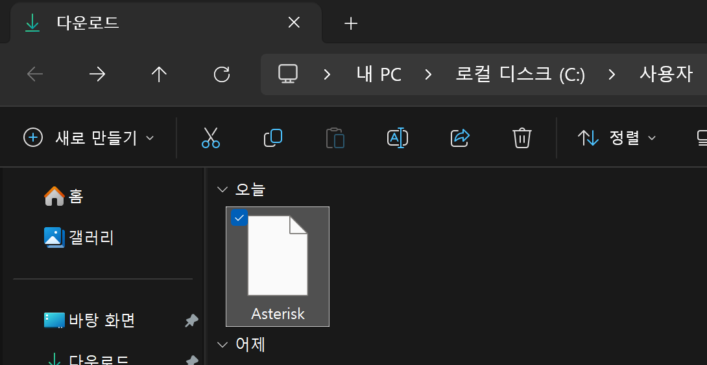

## 3. 마우스 오른쪽을 클릭한 후, `속성`을 클릭

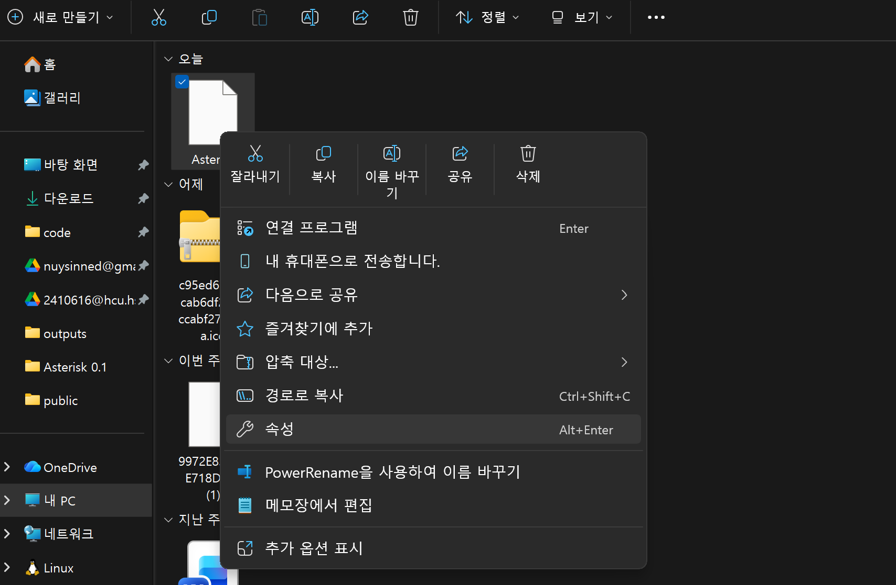

## 4. 파일명인 `Asterisk` 뒤에 `.exe`를 붙여 `Asterisk.exe`로 바꾼 후, `확인` 버튼 클릭

|  | →   | 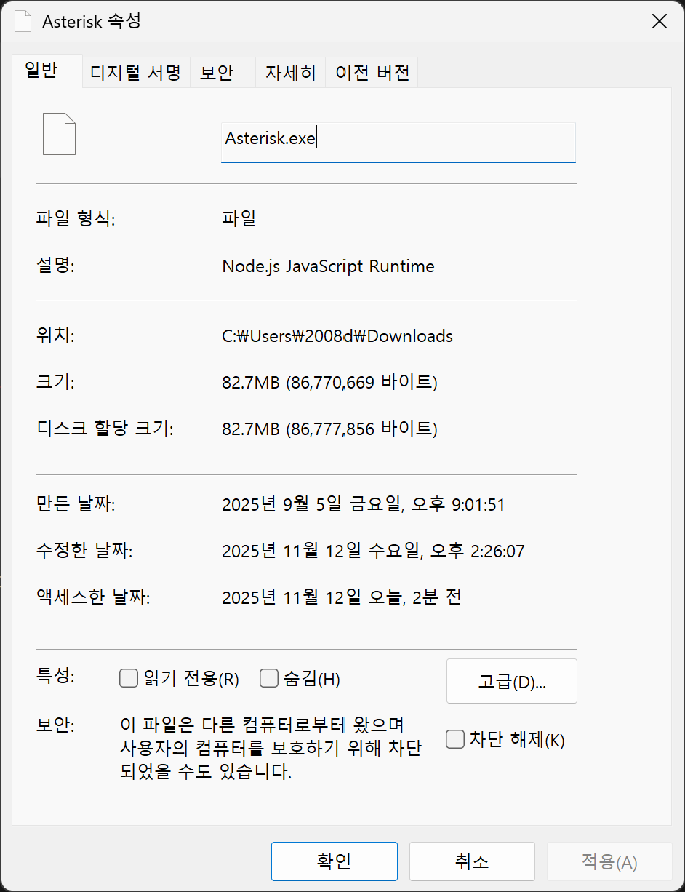 |
| ----------------------- | --- | ----------------------- |

파일 확장자가 `.exe`로 결정되고 이제 실행 파일으로써 `Asterisk*`를 실행할 수 있습니다. 처음부터 `Asterisk.exe`로 배포하지 않은 이유는 이 프로그램이 마우스 키보드 자동화 기능(쉽게 말하면 매크로)을 포함하고 있는데 이는 해킹 프로그램으로 인식될 가능성이 있기에 보안 프로그램이 프로그램 설치조차 막아버려서 그렇습니다...

## 5. 윈도우 디펜더가 실행을 막는데 `추가 정보`를 클릭한 후, `실행`을 클릭

|  | →   |  |
| -------------------------------- | --- | -------------------------------- |

# 이용법

## 1. 프로그램 실행

`Asterisk*`를 더블 클릭해 실행하면 다음과 같은 화면이 나옵니다.

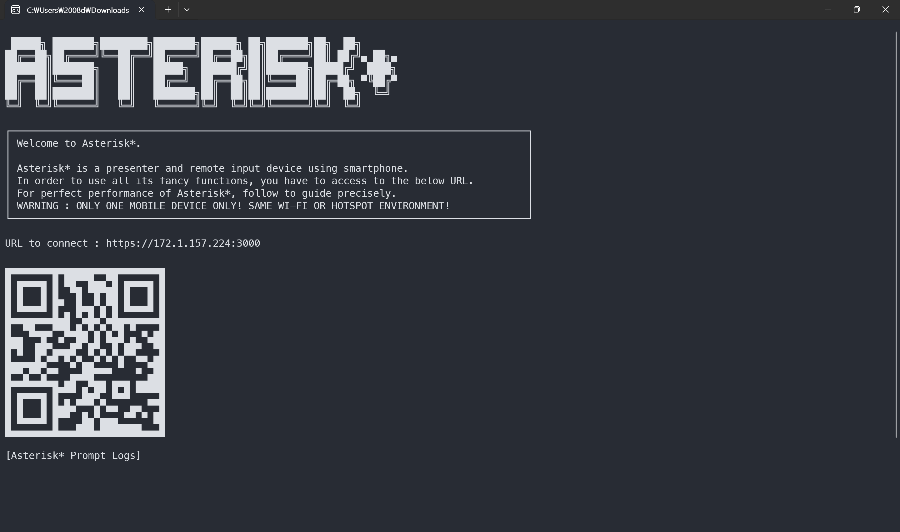

## 2. 스마트폰에서 웹사이트 열기

1. 위 이미지에서 `URL to connect`에 적힌 주소를 스마트폰에서 정확히 (https도 포함) 접속합니다. 혹은 스마트폰 카메라로 QR 코드를 인식합니다.

2. 그럼 위와 같은 이미지가 뜨는데 `고급` -> `~.~.~.~(안전하지 않음)`을 클릭합니다.

| 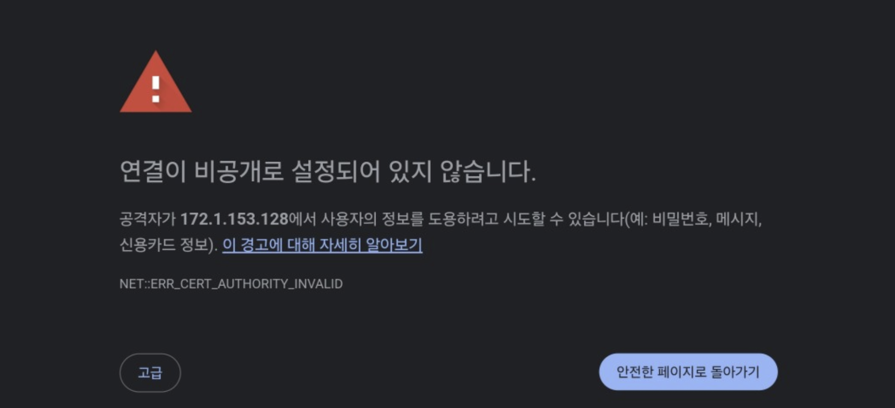 | →   | 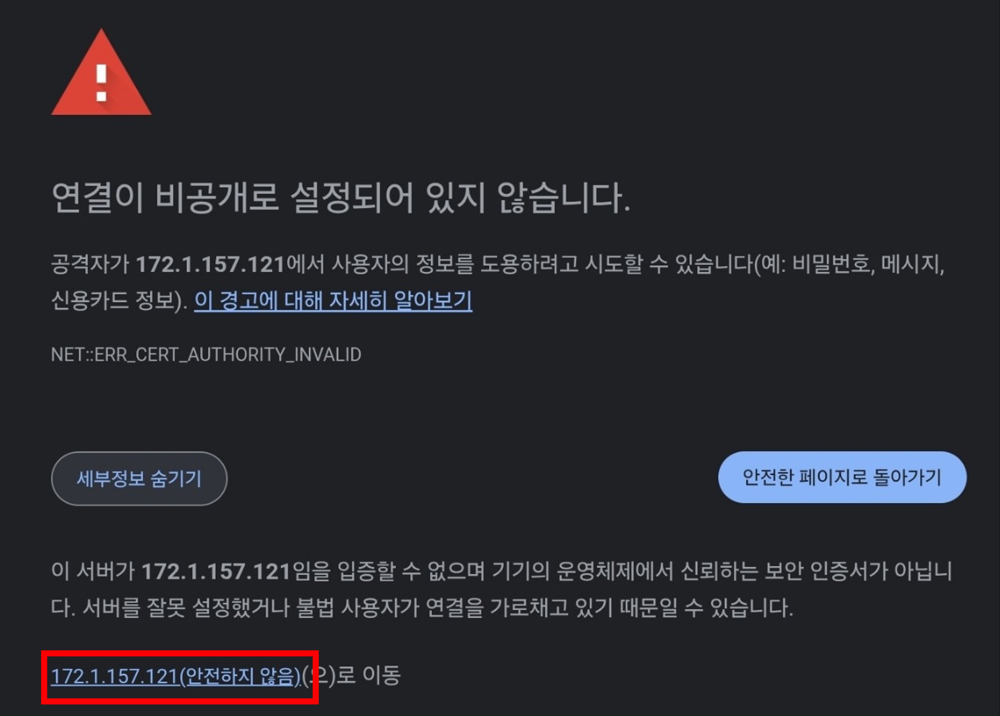 |
| ---------------------------- | --- | ------------------------------------------ |

3. Enjoy!

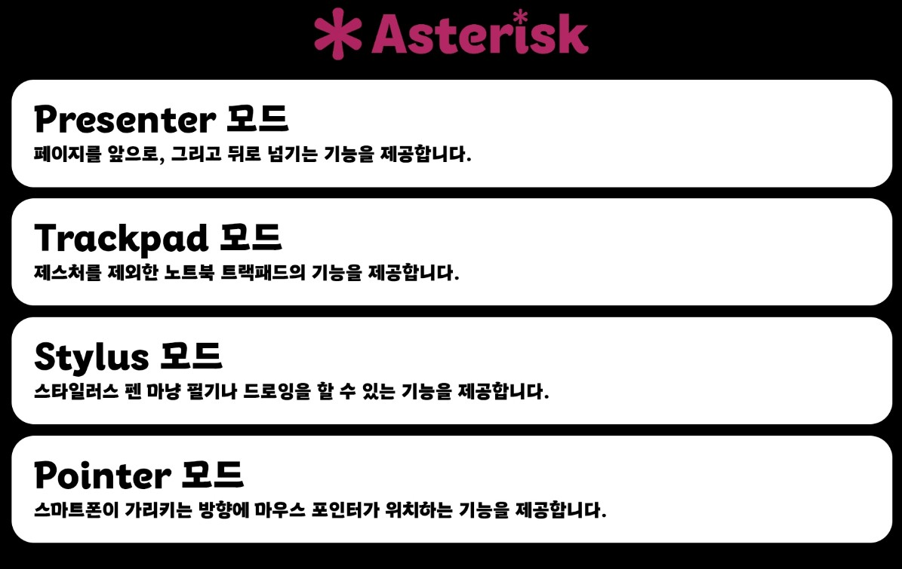

## 3. 각 모드 설명

1. `Presenter` 모드

| 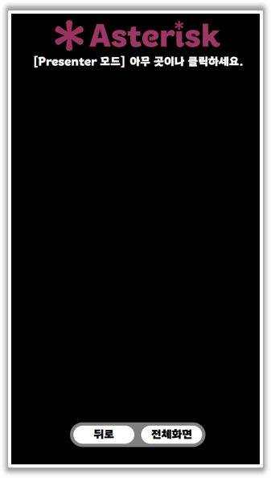 | :   | 검은 화면 아무 곳이나 클릭하면 다음 슬라이드로 넘어가고, `뒤로` 버튼을 클릭하면 이전 페이지로 넘어갑니다. |
| ----------------------------- | --- | --------------------------------------------------------------------------------------------------------- |

2. `Trackpad` 모드

| 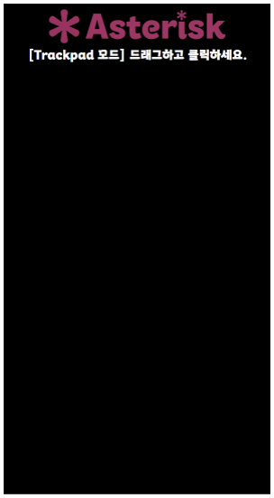 | :   | 손가락으로 드래그하면 트랙패드에서처럼 마우스 움직이고, 두 손가락으로 터치하면 마우스 오른쪽 누른 거고, 두 손가락으로 드래그하면 스크롤됩니다. 다만 인식률이 별로 안 좋습니다... |
| ---------------------------- | --- | -------------------------------------------------------------------------------------------------------------------------------------------------------------------------------- |

3. `Stylus` 모드

| 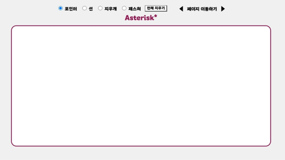 | :   | ppt에 포인터, 선, 지우개, 제스처 쓸 수 있습니다. 발표시에는 `디스플레이 복제`해야 동작합니다. |
| -------------------------- | --- | --------------------------------------------------------------------------------------------- |

4. `Pointer` 모드

| 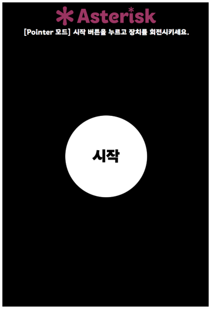 | :   | 만구 필요없는 레이저 포인터 같은 기능인데 버그도 많고 버벅... 엄... |
| --------------------------- | --- | ------------------------------------------------------------------- |
