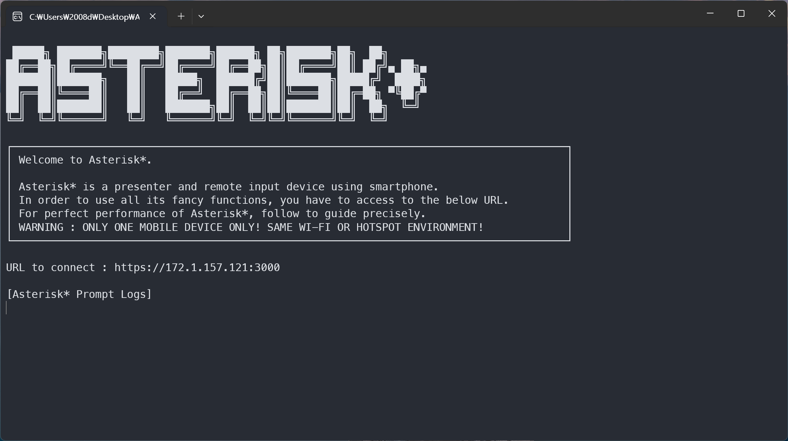

<b>스마트폰을 이용한 프리젠터 겸 원격 입력 장치</b>

# 다운로드 방법

## 1. `Asterisk*` 다운로드 받기

[여기를 클릭해](https://github.com/Chungun-Network-Plus/Asterisk/raw/main/assets/Asterisk) `Asterisk*`를 다운로드 받습니다.

## 2. `다운로드` 폴더로 이동하여 설치된 파일 찾기

## 3. 마우스 오른쪽을 클릭한 후, `속성`을 클릭

## 4. 파일명인 `Asterisk` 뒤에 `.exe`를 붙여 `Asterisk.exe`로 바꾼 후, `확인` 버튼 클릭

파일 확장자가 `.exe`로 결정되고 이제 실행 파일으로써 `Asterisk*`를 실행할 수 있습니다.

# 이용법

## 1. 프로그램 실행

`Asterisk*`를 더블 클릭해 실행하면 다음과 같은 화면이 나옵니다.

## 2. 스마트폰에서 웹사이트 열기

1. 위 이미지에서 `URL to connect`에 적힌 주소를 스마트폰에서 정확히 (https도 포함) 접속합니다.

2. 그럼 위와 같은 이미지가 뜨는데 `고급` -> `~.~.~.~(안전하지 않음)`을 클릭합니다.

3. Enjoy!

