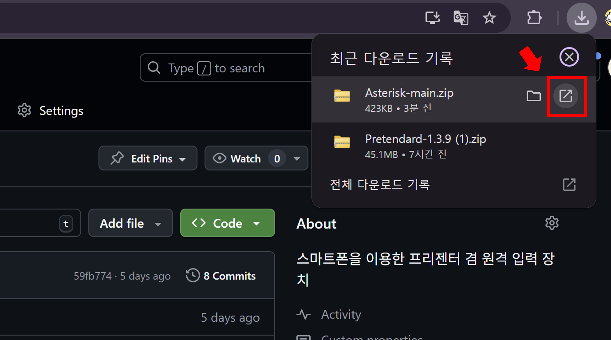

<div align=center>
<b>스마트폰을 이용한 프리젠터 겸 원격 입력 장치</b>
</div>


# 다운로드 방법

## 1. `Nodejs` 다운로드

[Nodejs 다운로드 사이트](https://nodejs.org/ko/)에 접속해 `Get Node.js` 버튼을 클릭해 `Node.js`를 다운로드 받습니다.


## 2. `Asterisk*` 설치를 위한 디렉토리 다운로드

1. [Asterisk\* 다운로드](https://github.com/Chungun-Network-Plus/Asterisk/archive/refs/heads/main.zip)를 클릭합니다.

2. 다운받은 폴더를 엽니다.



3. 압축을 풉니다. 압축 해제 폴더는 변경하지 않습니다.


## 3. 명령어 실행

1. `Windows` 검색창에 `cmd`를 검색해 `명령프롬프트`를 엽니다.


2. 다음 명령어를 입력하고 `enter` 키를 칩니다.

```
cd Downloads/Asterisk-main && npm install && npm run build:win
```

## 4. 바탕화면을 확인합니다.


